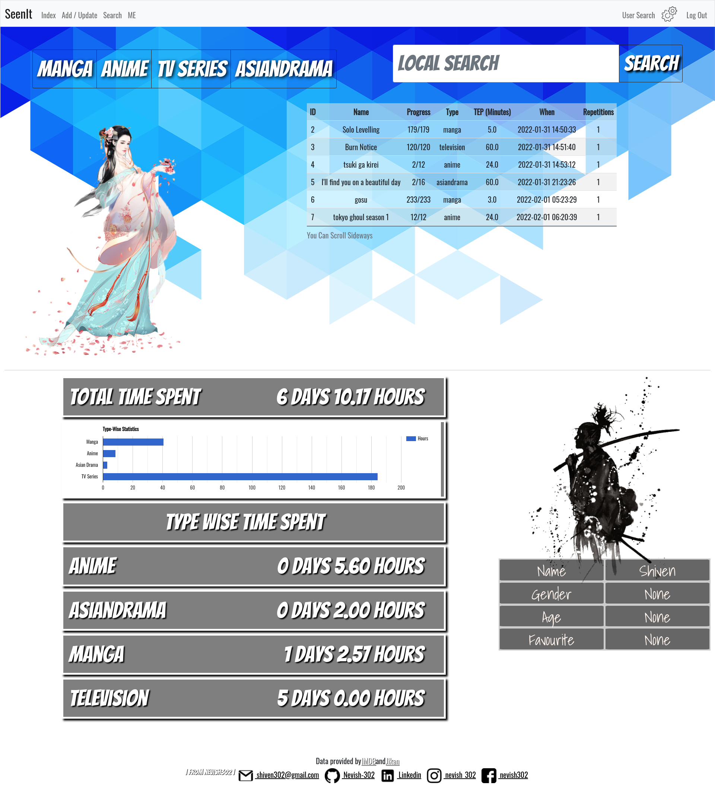
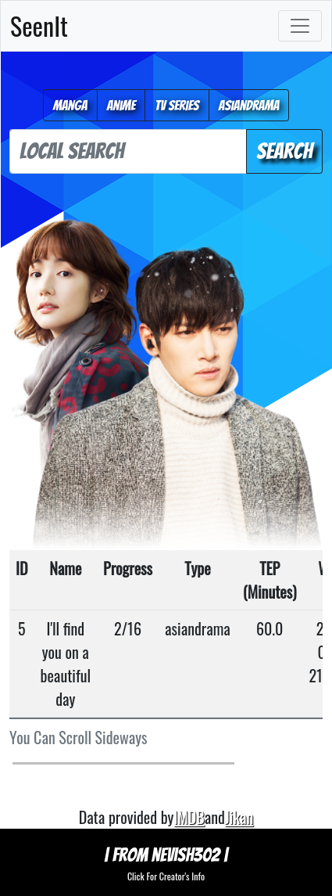
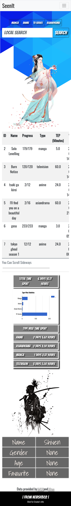

<div id="top"></div>
<!--
*** Thanks for checking out the Best-README-Template. If you have a suggestion
*** that would make this better, please fork the repo and create a pull request
*** or simply open an issue with the tag "enhancement".
*** Don't forget to give the project a star!
*** Thanks again! Now go create something AMAZING! :D
-->


<!-- PROJECT SHIELDS -->
<!--
*** I'm using markdown "reference style" links for readability.
*** Reference links are enclosed in brackets [ ] instead of parentheses ( ).
*** See the bottom of this document for the declaration of the reference variables
*** for contributors-url, forks-url, etc. This is an optional, concise syntax you may use.
*** https://www.markdownguide.org/basic-syntax/#reference-style-links
-->
[![Contributors][contributors-shield]][contributors-url]
[![Forks][forks-shield]][forks-url]
[![Stargazers][stars-shield]][stars-url]
[![Issues][issues-shield]][issues-url]
[![MIT License][license-shield]][license-url]
[![LinkedIn][linkedin-shield]][linkedin-url]


<!-- PROJECT LOGO -->
<br />
<div align="center">
  <a href="https://github.com/Nevish-302/SeenIt">
    
  </a>

<h3 align="center">SeenIt</h3>

  <p align="center">
    Interactive Entertainment Database
    <br />
    <a href="https://github.com/Nevish-302/SeenIt"><strong>Explore the docs »</strong></a>
    <br />
    <br />
    <a href="https://youtu.be/EZ4qqUSisVE">View Demo</a>
    ·
    <a href="https://github.com/Nevish-302/SeenIt/issues">Report Bug</a>
    ·
    <a href="https://github.com/Nevish-302/SeenIt/issues">Request Feature</a>
  </p>
</div>


<!-- TABLE OF CONTENTS -->
<details>
  <summary>Table of Contents</summary>
  <ol>
    <li>
      <a href="#about-the-project">About The Project</a>
      <ul>
        <li><a href="#built-with">Built With</a></li>
      </ul>
    </li>
    <li>
      <a href="#getting-started">Getting Started</a>
      <ul>
        <li><a href="#prerequisites">Prerequisites</a></li>
        <li><a href="#Installation">Installation</a></li>
      </ul>
    </li>
    <li><a href="#usage">Usage</a></li>
    <li><a href="#Information">Information</a></li>
    <li><a href="#roadmap">Roadmap</a></li>
    <li><a href="#contributing">Contributing</a></li>
    <li><a href="#license">License</a></li>
    <li><a href="#contact">Contact</a></li>
    <li><a href="#Authors">Authors</a></li>
    <li><a href="#acknowledgments">Acknowledgments</a></li>
  </ol>
</details>


<!-- ABOUT THE PROJECT -->
## About The Project

<b>Interactive Entertainment Database</b>
<br>
A Webapp where you can save progress of Anime/ Manga/ TV Series/ AsianDramas that you are watching or have already watched a few times. You can track how many hours you've spent in each of those and share it with others as well. You can also search info for TV shows and anime you might wanna add. Lastly, you can customize your profile here. 
<p align="right">(<a href="#top">back to top</a>)</p>


### Built With

* [HTML](https://developer.mozilla.org/en-US/docs/Web/HTML)
* [CSS](https://developer.mozilla.org/en-US/docs/Web/CSS)
* [Flask](https://flask.palletsprojects.com/en/2.0.x/)
* [Python](https://www.python.org/)
* [Bootstrap](https://getbootstrap.com)
* [JavaScript](https://www.javascript.com/)

<p align="right">(<a href="#top">back to top</a>)</p>


<!-- GETTING STARTED -->
## Getting Started

This is an example of how you may give instructions on setting up your project locally.
To get a local copy up and running follow these simple example steps.

### Prerequisites

This is an example of how to list things you need to use the software and how to install them.

```console
pip install cs50
pip install Flask
pip install Flask-Session
pip install psycopg2-binary
pip install requests
pip install Flask-mail
pip install requests
pip install mail
pip install sqlite3
pip install Flask-APScheduler

```

<p align="right">(<a href="#top">back to top</a>)</p>

## Installation


Clone Project:

```console
git clone git@github.com/Nevish-302/SeenIt.git
```

install Prerequisites

## Database ##
Create a new database SeenIt.db and replace the one provided by it. 
```console
sqlite3 SeenIt.db
```
Execute the following commands.

```console
CREATE TABLE users (id INTEGER, username TEXT NOT NULL, hash TEXT NOT NULL, tablename TEXT NOT NULL, confirmation INTEGER, PRIMARY KEY(id));

CREATE TABLE personalinfo(id INTEGER NOT NULL, name TEXT, gender TEXT, age INTEGER, FAV TEXT, profilepic INTEGER);
```
## Flask Mail ##

You will need to export your username password and sender email:
```
export MAIL_DEFAULT_SENDER=SeenIt
export API_KEY_JIKAN=#YOUR_API_IMDB_KEY#
export API_KEY_IMDB=#YOUR_API_IMDB_KEY#
export MAIL_PASSWORD=#YOUR_PASSWORD_HERE#
export MAIL_USERNAME=shiven302@gmail.com
```
You can get your IMDB API KEY at https://imdb-api.com/
<br>
You can get your JIKAN API KEY at https://rapidapi.com/theapiguy/api/jikan1/
<br>
FYI both of these are free

## Flask ##

Start flask:
```console
flask run
```


<!-- USAGE EXAMPLES -->
## Usage

* Password protected login
* Email confirmation
* Index page 
  * Click on any of the tabs to view selected type onle
  * Search on local search to search through already added data
* Add / Update page
  * Input information in the boxes provided and click on add
  * Select the row and the column to update, input information and click on update
  * Select the id of the row to be deleted and click on delete
* Search Page
  * input information in any of the boxes provided and search
  * The information is returned from already existing APIs (IMDB and JIKAN) 
* ME page
  * your stats (graph and other information) and profile is displayed here
* Settings page (settings icon in navbar)
  * Type once in password, again in confirm password field and click on change password to do so 
  * Type info and select the type of info you want to change in your profile
  * Names of the profile pictures available are provided below 
* User Search Page 
  * You can search for lists and profiles of other users in this tab
  * Note that it is not mandatory to have an id on the website to use this feature 

For more examples, please refer to the [Documentation](https://example.com)

<p align="right">(<a href="#top">back to top</a>)</p>

## Information

Screenshots of the application below:

#
Laptop / PC

<b>Login Page</b>


<b>Index Page</b>


<b>Add/Update Page</b>


<b>Search Page</b>


<b>Anime SearchResult Page</b>


<b>TV series SearchResult Page</b>


<b>ME Page</b>


<b>UserSearch Page</b>



<b>Settings Page</b>


#
## Mobile

<b>Login Page</b>


<b>Index Page</b>



<b>Add/Update Page</b>


<b>Search Page</b>


<b>Index With Creator Info and menu open</b>


<b>TV series SearchResult Page</b>


<b>ME Page</b>


<b>UserSearch Page</b>



<b>Settings Page</b>


<p align="right">(<a href="#top">back to top</a>)</p>
<!-- ROADMAP -->

## Roadmap


### New Technologies
- [X] Flask-mail
- [X] IMDB API
- [X] JINKAN API
- [X] Flask-mail
- [x] Flask-Markdown
- [x] Token Email verification

### Web Framework (Flask | Gunicorn)
- [x] Register
- [x] Flask email (resister confirmation)
    - [x] Token email confirmation 
- [x] Login
- [x] Index (list of shows watched)
    - [x] Local Search
    - [x] Type Wise Data View
- [x] Add/update
    - [x] Add Data
    - [x] Modify Data
    - [x] Delete Data
- [x] Search
    - [x] TV Series Search
    - [x] Anime Search
- [x] Me
    - [x] Total Time Spent and Type Wise Spent
    - [x] Bar Graph Base On TypeWise
- [x] User Search
    - [x] Search for users other than you as long as you have their email id
    - [x] This feature can be used without login/registeration as well
- [x] Settings
    - [x] Verify Personal Data
    - [x] Change Profile Picture
- [x] My contact info
    - [x] As Footer In Each Page on PCs
    - [x] As An Expandable footer On Each Page on mobiles
- [x] Logout
- [x] Render this README as about page 

### Front-end (HTML | CSS | JS | Bootstrap)
- [x] styles.css
    - [x] different css for mobiles and laptops
    - [x] responsive css
- [x] login.html
- [x] index.html
- [x] addupdate.html
- [x] apology.html
- [x] change.html
- [x] confirmemail.com
- [x] layout.html
- [x] myself.html
- [x] results.html
- [x] resultsanime.html
- [x] search.html
- [x] userresult.html
- [x] usrsearch.html
- [x] Bootstrap
    - [x] Tables
    - [x] Part Of Forms
    - [x] Dropdown Navbar Specifically For Mobiles
- [x] Owner Info Dropdown Menu Specifically For Mobiles 
- [x] Favicon, and many png images used throughout the app (thank you [pngwing.com](https://https://www.pngwing.com/))


### Database (SQLite3)
- [x] User table
- [x] Personal Info table
- [x] List tables for every user
- [x] Menu table
- [x] Email confirmation column 

### Deployment (Github | Heroku)
- [x] Github
- [x] Connect Github to Heroku
- [x] Manual deployment

### README
- [x] Name
- [x] Local Setup
- [x] Screenshots
- [x] Authors
- [x] Contributing
- [x] License
- [x] Road Map

See the [open issues](https://github.com/Nevish-302/SeenIt/issues) for a full list of proposed features (and known issues).

<p align="right">(<a href="#top">back to top</a>)</p>


<!-- CONTRIBUTING -->
## Contributing

Contributions are what make the open source community such an amazing place to learn, inspire, and create. Any contributions you make are **greatly appreciated**.

If you have a suggestion that would make this better, please fork the repo and create a pull request. You can also simply open an issue with the tag "enhancement".
Don't forget to give the project a star! Thanks again!

1. Fork the Project
2. Create your Feature Branch (`git checkout -b feature/SeenIt`)
3. Commit your Changes (`git commit -m 'Add some Feature'`)
4. Push to the Branch (`git push origin feature/SeenIt`)
5. Open a Pull Request

<p align="right">(<a href="#top">back to top</a>)</p>


<!-- LICENSE -->
## License

Distributed under the MIT License. See `LICENSE` for more information.

<p align="right">(<a href="#top">back to top</a>)</p>


<!-- CONTACT -->
## Contact

Your Name - [@nevish_302](https://www.instagram.com/nevish_302) - shiven302@gmail.com

Project Link: [https://github.com/Nevish-302/SeenIt](https://github.com/Nevish-302/SeenIt)

<p align="right">(<a href="#top">back to top</a>)</p>


<!-- ACKNOWLEDGMENTS -->
## Authors

* [Nevish-302](https:github.com/Nevish-302)

<p align="right">(<a href="#top">back to top</a>)</p>


## Credits

* [pngwing](https://www.pngwing.com/)
* [cs50](https://cs50.harvard.edu/x/2022/)  
* [Best-README-Template](https://github.com/othneildrew/Best-README-Template)
<p align="right">(<a href="#top">back to top</a>)</p>


<!-- MARKDOWN LINKS & IMAGES -->
<!-- https://www.markdownguide.org/basic-syntax/#reference-style-links -->
[contributors-shield]: https://img.shields.io/github/contributors/Nevish-302/SeenIt.svg?style=for-the-badge
[contributors-url]: https://github.com/Nevish-302/SeenIt/graphs/contributors
[forks-shield]: https://img.shields.io/github/forks/Nevish-302/SeenIt.svg?style=for-the-badge
[forks-url]: https://github.com/Nevish-302/SeenIt/network/members
[stars-shield]: https://img.shields.io/github/stars/Nevish-302/SeenIt.svg?style=for-the-badge
[stars-url]: https://github.com/Nevish-302/SeenIt/stargazers
[issues-shield]: https://img.shields.io/github/issues/Nevish-302/SeenIt.svg?style=for-the-badge
[issues-url]: https://github.com/Nevish-302/SeenIt/issues
[license-shield]: https://img.shields.io/github/license/Nevish-302/SeenIt.svg?style=for-the-badge
[license-url]: https://github.com/Nevish-302/SeenIt/blob/master/LICENSE.txt
[linkedin-shield]: https://img.shields.io/badge/-LinkedIn-black.svg?style=for-the-badge&logo=linkedin&colorB=555
[linkedin-url]: https://linkedin.com/in/shiven-upadhyay-9834bb100/
[product-screenshot]: images/screenshot.png
